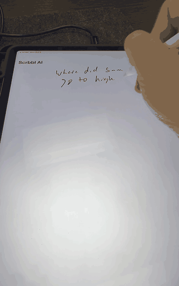

# Scrbbl AI

Write anything on your iPad with an Apple Pencil, underline it three times, and the answer appears handwritten below.

Website: [scrbbl.ai](https://scrbbl.ai)

Watch the full 1-minute demo (underline, then circle for a longer answer)

https://github.com/user-attachments/assets/557c5f08-59ed-41bb-8fe6-ea68be49425b

## How it works

- **Write it down.** Any question or text, anywhere on the page.
- **Underline it three times** for a quick AI answer. It searches the web when the question needs current information.
- **Or circle it** for a fuller answer with examples.

The app sends a picture of your handwriting to the AI, so it reads messy writing well. Answers stream in word by word and are shown in a handwriting font.

## Requirements

- An iPad running iPadOS 17 or later, and an Apple Pencil
- A Mac with Xcode 26 or later
- An [OpenAI API key](https://platform.openai.com/api-keys) with credits

## Run it

1. Open `Scrbbl.xcodeproj` in Xcode.
2. Under **Signing & Capabilities**, choose your own team and, if needed, change the bundle identifier (`ai.scrbbl.app`) to one you own.
3. Pick your iPad (or an iPad simulator) and press **Run**.
4. In the app, open **Settings**, paste your OpenAI API key, and tap **Save API key**.

In the simulator there's no Apple Pencil, so the canvas also accepts mouse and trackpad input. On a real iPad it accepts only Pencil input, so your fingers can scroll.

For simulator testing, `scripts/launch-with-key.command` passes a key to a Debug build without typing it into the app.

## Settings

- **Fast** (default): GPT-6 Luna with reasoning off and OpenAI's fast processing tier.
- **Smart:** GPT-6.1 Sol with light reasoning. Slower, deeper answers.

Both can use web search for time-sensitive questions.

## Project layout

| Path | What it is |
| --- | --- |
| `Scrbbl/TripleUnderlineDetector.swift` | Recognizes the triple underline and circle gestures, and finds the handwriting they point at |
| `Scrbbl/NoteCanvasModel.swift` | Renders the handwriting, calls the OpenAI Responses API with streaming, stores the key in the Keychain |
| `Scrbbl/NoteCanvasView.swift` | The PencilKit canvas and the handwritten answer box |
| `Scrbbl/SettingsView.swift` | API key, answer speed, and gesture help |
| `Scrbbl/Fonts` | Nothing You Could Do, the handwriting font used for answers (SIL Open Font License) |
| `design/make_icon.py` | Generates the app icon |
| `design/make_social_preview.py` | Generates the social preview card (`docs/social-preview.png`) |

## Privacy and security

Your API key is stored in the iPad's Keychain and never leaves the device except to call OpenAI. Images of the handwriting you underline or circle are sent to OpenAI to produce answers.

The app calls OpenAI directly from the iPad, which is fine for personal use. A public App Store release should route requests through a backend instead, because a key inside an app can be extracted.

## Contributing

Issues and pull requests are welcome. See [CONTRIBUTING.md](CONTRIBUTING.md), and look for issues labeled **good first issue** to get started.

## License

MIT, see `LICENSE`. The bundled font is licensed separately under the SIL Open Font License (`Scrbbl/Fonts/OFL.txt`).

An open source project by [Adam Probolsky](https://www.linkedin.com/in/adamprobolsky).
